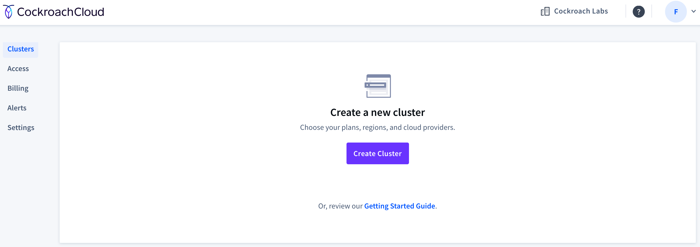
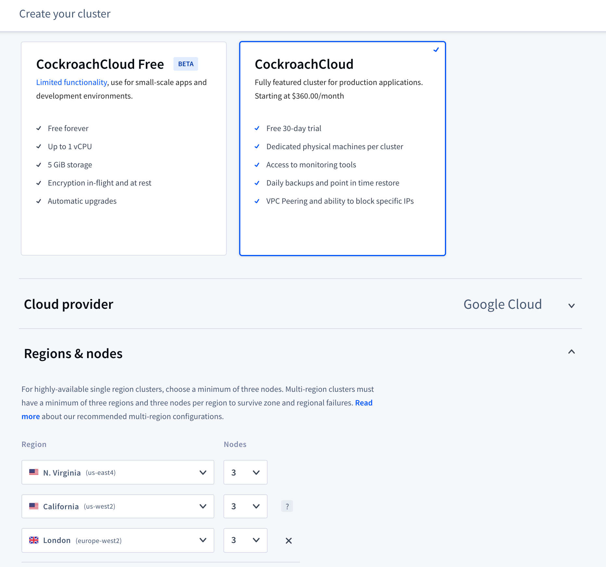
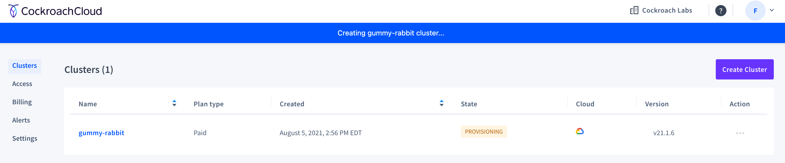
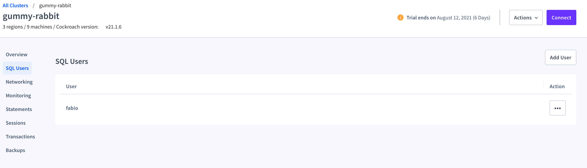
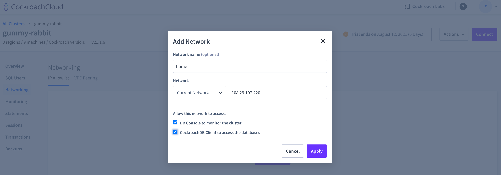
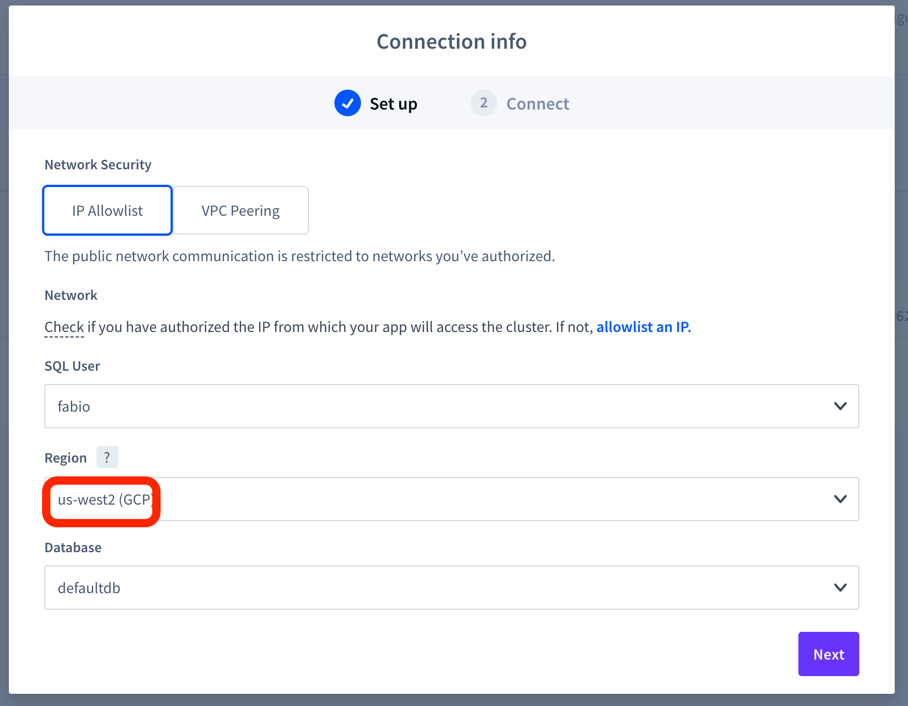
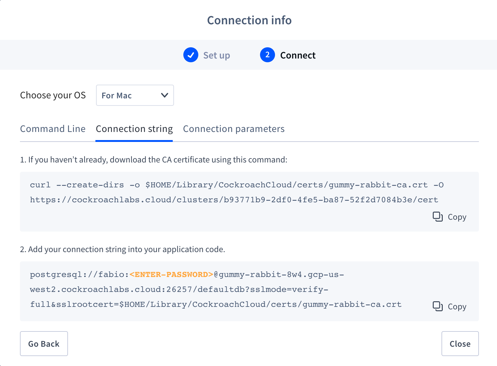
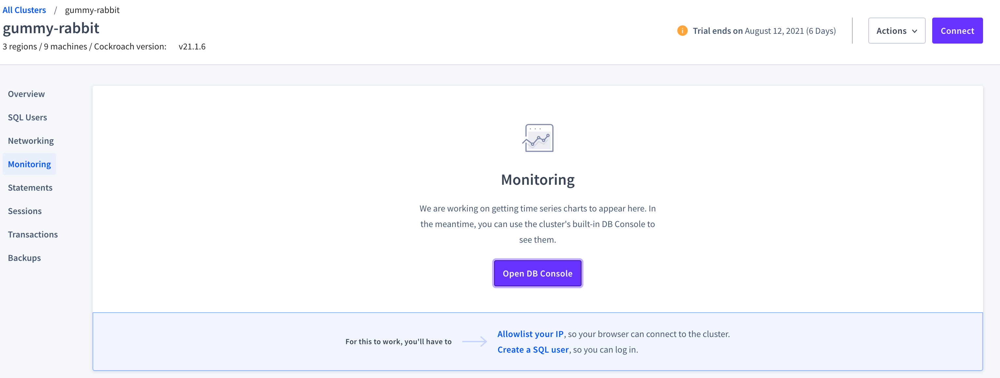
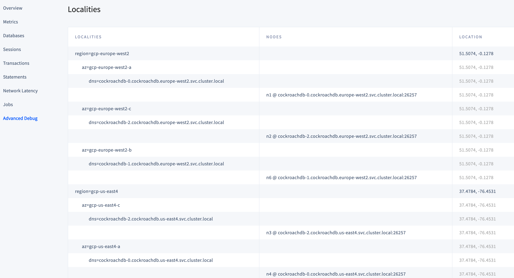
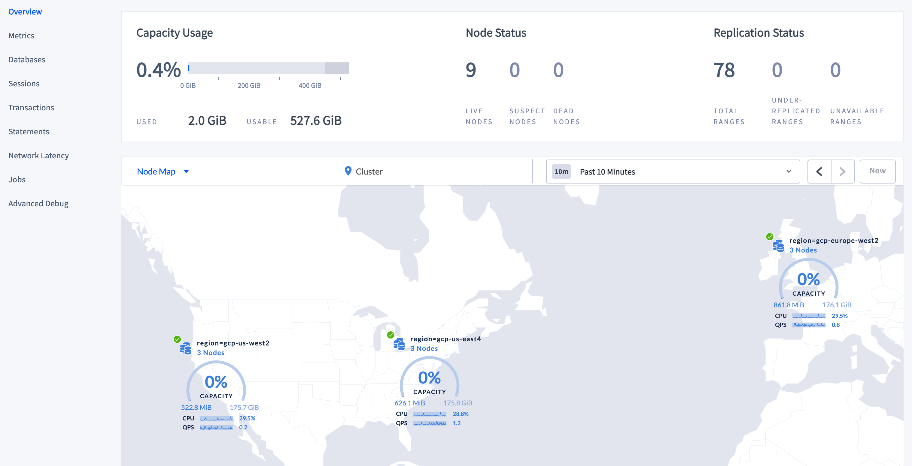

# Topology Patterns

In these labs we will work with CockroachDB [Topology Patterns](https://www.cockroachlabs.com/docs/v20.2/topology-patterns) and understand the use cases, pros and cons for each one.

## Overview

There are 6 topology patterns:

| Topology                                                                                                             | Description | Pros | Cons |
|----------------------------------------------------------------------------------------------------------------------|-------------|------|------|
| [Basic Production](https://www.cockroachlabs.com/docs/v20.2/topology-basic-production.html)                         | Single region deployment | Fast r/w | Can't survive region failure |
| [Geo-Partitioned Replicas](https://www.cockroachlabs.com/docs/v20.2/topology-geo-partitioned-replicas.html)         | Multi-region deployment where data is partitioned and pinned to a specific region, ideal for GDPR or similar legal compliance | Fast r/w if client is connected to the region which holds the data is querying | Locked data can't survive region failure - it would require multiple regions in the same country|
| [Geo-Partitioned Leaseholders](https://www.cockroachlabs.com/docs/v20.2/topology-geo-partitioned-leaseholders.html) | Multi-region deployment where leaseholder is pinned to a specific region | Fast reads if client connects to region which holds the data; can survive region failure | Slightly slower writes as leaseholder has to seek consensus outside its region |
| [Duplicate Indexes](https://www.cockroachlabs.com/docs/v20.2/topology-duplicate-indexes.html)                       | Most used indexes are duplicated by the amount of regions and the index leaseholders are pinned 1 per region; ideal for data that doesn't frequently updates  | Fast reads from any region | Slower writes as every index needs to be updated; duplicate data increases storage |
| [Follower Reads](https://www.cockroachlabs.com/docs/v20.2/topology-follower-reads.html)                             | Special feature that enables reading from any of the replicas | fast reads as the closest replica can be queried instead of the leaseholder, which can be in another region; no added storage cost | data can be slightly historical |
| [Follow-the-Workload](https://www.cockroachlabs.com/docs/v20.2/topology-follow-the-workload.html)                   | Default topology. Leaseholder moves automatically to the region where most of the queries originate | - | - |

## Labs Prerequisites

- a modern web browser
- [Cockroach SQL client](https://www.cockroachlabs.com/docs/stable/install-cockroachdb-linux)

## Lab 0 - Create your Cockroach Cloud Cluster

Login into [Cockroach Cloud](https://cockroachlabs.cloud/) and click on 'Create Cluster'



Select the **Cockroach Cloud** plan, and choose **Google Cloud** regions **N. Virginia, California, London**



Proceed to the payment plan, and click on **Create Cluster**.
Wait until the cluster is provisioned



Once deployed, create a **SQL User**



then create the required **networking**, in this case, we allow my home IP



Finally, retrieve as usual the CA cert and the Connection URL for region **us-west2**





At this point, connect to the cluster to confirm everything is working well

```bash
$ cockroach sql --url 'postgresql://<yourname>:<password>@<hostname>:26257/movr?[...]'
#
# Welcome to the CockroachDB SQL shell.
# All statements must be terminated by a semicolon.
# To exit, type: \q.
#
# Server version: CockroachDB CCL v21.1.6 (x86_64-unknown-linux-gnu, built 2021/07/20 15:30:39, go1.15.11) (same version as client)
# Cluster ID: e618e3f1-49c4-41cb-a4bb-ee24c890d7e8
# Organization: Cockroach Cloud - crl-prod-8w4
#
# Enter \? for a brief introduction.
#
fabio@gummy-rabbit-8w4.gcp-us-west2.cockroachlabs.cloud:26257/defaultdb>
```

Good job, your cluster is ready!

## Lab 1 - Load the data

Generate the sample data using the `cockroach workload` function, see more [here](https://www.cockroachlabs.com/docs/v21.1/movr.html).

```bash
# ensure you change the database name from 'defaultdb' to 'movr'
$ cockroach workload init movr --drop --num-histories 50000 --num-rides 50000 --num-users 1000 --num-vehicles 100 'postgresql://<yourname>:<password>@<hostname>:26257/movr?[...]'
I210805 14:59:44.063427 1 workload/workloadsql/dataload.go:146  [-] 1  imported users (3s, 1000 rows)
I210805 14:59:46.581774 1 workload/workloadsql/dataload.go:146  [-] 2  imported vehicles (3s, 100 rows)
I210805 14:59:55.875105 1 workload/workloadsql/dataload.go:146  [-] 3  imported rides (9s, 50000 rows)
I210805 15:00:01.454043 1 workload/workloadsql/dataload.go:146  [-] 4  imported vehicle_location_histories (6s, 50000 rows)
I210805 15:00:04.545922 1 workload/workloadsql/dataload.go:146  [-] 5  imported promo_codes (3s, 1000 rows)
I210805 15:00:04.840858 1 workload/workloadsql/workloadsql.go:113  [-] 6  starting 8 splits
I210805 15:00:20.276409 1 workload/workloadsql/workloadsql.go:113  [-] 7  starting 8 splits
I210805 15:00:37.869859 1 workload/workloadsql/workloadsql.go:113  [-] 8  starting 8 splits
```

Now connect to the database

```bash
# again, ensure you replace 'defaultdb' with 'movr' in your connection string
cockroach sql --url 'postgresql://<yourname>:<password>@<hostname>:26257/movr?[...]'
```

## Lab 2 - Explore Range distribution

Confirm data loaded successfully

```sql
SHOW TABLES;
```

```text
  schema_name |         table_name         | type  | owner | estimated_row_count | locality
--------------+----------------------------+-------+-------+---------------------+-----------
  public      | promo_codes                | table | fabio |                1000 | NULL
  public      | rides                      | table | fabio |               50000 | NULL
  public      | user_promo_codes           | table | fabio |                   0 | NULL
  public      | users                      | table | fabio |                1000 | NULL
  public      | vehicle_location_histories | table | fabio |               50000 | NULL
  public      | vehicles                   | table | fabio |                 100 | NULL
(6 rows)

Time: 1.519s
```

In Cockroach Cloud, go to **Monitoring > DB Console** and login with the same username and password you previously setup.



Check the **Advanced Debug > Localities** page to see the localities associated with your nodes.



Also, you can see the distribution of your node using the **Map View**.



Now that you have imported the data, review how the ranges are distributed in the `rides` table. We create our own view to only project columns of interest. Feel free to modify as you see fit.

```sql
CREATE VIEW ridesranges AS
  SELECT
    SUBSTRING(start_key, 2, 15) AS start_key,
    SUBSTRING(end_key, 2, 15) AS end_key,
    lease_holder AS lh,
    split_part(string_to_array(lease_holder_locality, ',')[2], '=', 2) AS lh_loc,
    replicas,
    array(split_part(string_to_array(replica_localities[1], ',')[2], '=', 2), split_part(string_to_array(replica_localities[2], ',')[2], '=', 2), split_part(string_to_array(replica_localities[3], ',')[2], '=', 2)) as replicas_loc
  FROM [SHOW RANGES FROM TABLE rides]
  WHERE start_key IS NOT NULL AND start_key NOT LIKE '%Prefix%';

SELECT * FROM ridesranges;
```

```text
     start_key    |     end_key     | lh |       lh_loc       | replicas |                    replicas_loc
------------------+-----------------+----+--------------------+----------+-----------------------------------------------------
  "amsterdam"/"\x | "boston"/"8\xe2 |  2 | gcp-europe-west2-c | {2,5,7}  | {gcp-europe-west2-c,gcp-us-east4-b,gcp-us-west2-b}
  "boston"/"8\xe2 | "los angeles"/" |  2 | gcp-europe-west2-c | {2,5,7}  | {gcp-europe-west2-c,gcp-us-east4-b,gcp-us-west2-b}
  "los angeles"/" | "new york"/"\x1 |  2 | gcp-europe-west2-c | {2,3,9}  | {gcp-europe-west2-c,gcp-us-east4-c,gcp-us-west2-c}
  "new york"/"\x1 | "paris"/"\xe3\x |  2 | gcp-europe-west2-c | {2,3,9}  | {gcp-europe-west2-c,gcp-us-east4-c,gcp-us-west2-c}
  "paris"/"\xe3\x | "san francisco" |  9 | gcp-us-west2-c     | {2,3,9}  | {gcp-europe-west2-c,gcp-us-east4-c,gcp-us-west2-c}
  "san francisco" | "seattle"/"q\xc |  9 | gcp-us-west2-c     | {3,6,9}  | {gcp-us-east4-c,gcp-europe-west2-b,gcp-us-west2-c}
  "seattle"/"q\xc | "washington dc" |  9 | gcp-us-west2-c     | {2,3,9}  | {gcp-europe-west2-c,gcp-us-east4-c,gcp-us-west2-c}
  "washington dc" | NULL            |  9 | gcp-us-west2-c     | {2,4,9}  | {gcp-europe-west2-c,gcp-us-east4-a,gcp-us-west2-c}
(8 rows)
```

Each range has been replicated in each region, check the `replicas` and `replica_lo` columns.

Review how indexes are distributed on the `movr.rides`

```sql
SHOW CREATE TABLE rides;
```

```text
  table_name |                                                        create_statement
-------------+----------------------------------------------------------------------------------------------------------------------------------
  rides      | CREATE TABLE public.rides (
             |     id UUID NOT NULL,
             |     city VARCHAR NOT NULL,
             |     vehicle_city VARCHAR NULL,
             |     rider_id UUID NULL,
             |     vehicle_id UUID NULL,
             |     start_address VARCHAR NULL,
             |     end_address VARCHAR NULL,
             |     start_time TIMESTAMP NULL,
             |     end_time TIMESTAMP NULL,
             |     revenue DECIMAL(10,2) NULL,
             |     CONSTRAINT "primary" PRIMARY KEY (city ASC, id ASC),
             |     CONSTRAINT fk_city_ref_users FOREIGN KEY (city, rider_id) REFERENCES public.users(city, id),
             |     CONSTRAINT fk_vehicle_city_ref_vehicles FOREIGN KEY (vehicle_city, vehicle_id) REFERENCES public.vehicles(city, id),
             |     INDEX rides_auto_index_fk_city_ref_users (city ASC, rider_id ASC),
             |     INDEX rides_auto_index_fk_vehicle_city_ref_vehicles (vehicle_city ASC, vehicle_id ASC),
             |     FAMILY "primary" (id, city, vehicle_city, rider_id, vehicle_id, start_address, end_address, start_time, end_time, revenue),
             |     CONSTRAINT check_vehicle_city_city CHECK (vehicle_city = city)
             | )
(1 row)
```

Show ranges from one of the indexes

```sql
SHOW RANGES FROM INDEX rides_auto_index_fk_city_ref_users;
```

```text
  start_key | end_key | range_id | range_size_mb | lease_holder |      lease_holder_locality            | replicas |                                                     replica_localities
------------+---------+----------+---------------+--------------+---------------------------------------+----------+-----------------------------------------------------------------------------------------------------------------------------------
  NULL      | NULL    |      129 |      8.888912 |            9 | region=gcp-us-west2,az=gcp-us-west2-c | {2,4,9}  | {"region=gcp-europe-west2,az=gcp-europe-west2-c","region=gcp-us-east4,az=gcp-us-east4-a","region=gcp-us-west2,az=gcp-us-west2-c"}
```

Again, the index replicas are also spread across regions.

## Lab 2 - Geo-Partitioned Replicas

Read how you can tune the performance of the database using [partitioning](https://www.cockroachlabs.com/docs/v20.2/partitioning.html). You can read the docs about [configuring replication zones](https://www.cockroachlabs.com/docs/v20.2/configure-replication-zones.html) with some examples [here](https://www.cockroachlabs.com/docs/v20.2/configure-replication-zones.html#create-a-replication-zone-for-a-partition).

Partition the `rides` table by column `city` to the appropriate regions (`gcp-us-west2`, `gcp-us-east4`, `gcp-europe-west2`).

```sql
ALTER TABLE rides PARTITION BY LIST (city) (
  PARTITION us_west_2 VALUES IN ('los angeles', 'seattle', 'san francisco'),
  PARTITION us_east_4 VALUES IN ('new york','boston', 'washington dc'),
  PARTITION eu_west_2 VALUES IN ('paris','rome','amsterdam')
);
```

Confirm the partition job was successful

```sql
SHOW PARTITIONS FROM TABLE rides;
```

```text
  database_name | table_name | partition_name | parent_partition | column_names |  index_name   |                 partition_value                 | zone_config |       full_zone_config
----------------+------------+----------------+------------------+--------------+---------------+-------------------------------------------------+-------------+-------------------------------
  movr          | rides      | eu_west_2      | NULL             | city         | rides@primary | ('paris'), ('rome'), ('amsterdam')              | NULL        | range_min_bytes = 134217728,
                |            |                |                  |              |               |                                                 |             | range_max_bytes = 536870912,
                |            |                |                  |              |               |                                                 |             | gc.ttlseconds = 90000,
                |            |                |                  |              |               |                                                 |             | num_replicas = 3,
                |            |                |                  |              |               |                                                 |             | constraints = '[]',
                |            |                |                  |              |               |                                                 |             | lease_preferences = '[]'
  movr          | rides      | us_east_4      | NULL             | city         | rides@primary | ('new york'), ('boston'), ('washington dc')     | NULL        | range_min_bytes = 134217728,
                |            |                |                  |              |               |                                                 |             | range_max_bytes = 536870912,
                |            |                |                  |              |               |                                                 |             | gc.ttlseconds = 90000,
                |            |                |                  |              |               |                                                 |             | num_replicas = 3,
                |            |                |                  |              |               |                                                 |             | constraints = '[]',
                |            |                |                  |              |               |                                                 |             | lease_preferences = '[]'
  movr          | rides      | us_west_2      | NULL             | city         | rides@primary | ('los angeles'), ('seattle'), ('san francisco') | NULL        | range_min_bytes = 134217728,
                |            |                |                  |              |               |                                                 |             | range_max_bytes = 536870912,
                |            |                |                  |              |               |                                                 |             | gc.ttlseconds = 90000,
                |            |                |                  |              |               |                                                 |             | num_replicas = 3,
                |            |                |                  |              |               |                                                 |             | constraints = '[]',
                |            |                |                  |              |               |                                                 |             | lease_preferences = '[]'
(3 rows)
```

Perfect! Let us assume we have a regulatory EU requirement that imposes EU data to stay within the EU (inluding the UK).
Currently we are not compliant as Rome, Paris and Amsterdam data is replicated in the US East and US West regions.

With the [Geo-Partitioned Replicas](https://www.cockroachlabs.com/docs/v20.2/topology-geo-partitioned-replicas.html) topology pattern, we can pin all replicas to a particular region/area.

Pros:

- fast read and writes from in-region requests
- Able to comply with legal regulations.

Cons:

- As data is pinned to a single region we can't survive region failure or we need a more complex setup (e.g: more regions within the same country)

Pinning data to nodes is very easy, it all depends on what labels you passed to the `--locality` flag when you run the CockroachDB process.
For our cluster, we passed `--locality=region=gcp-europe-west2,zone=a|b|c` so we will use `region` to pin partitions to the correct place.

The `lease_preferences` will be set to the target region and the `constaints` will be set to place **all** replicas in the same region as the leaseholder.

```sql
ALTER PARTITION eu_west_2 OF INDEX rides@*
CONFIGURE ZONE USING
  num_replicas = 3,
  constraints = '{"+region=gcp-europe-west2"}',
  lease_preferences = '[[+region=gcp-europe-west2]]';
```

After few minutes, verify all replicas for the European cities are in the `gcp-europe-west2` region

```sql
SELECT * FROM ridesranges ORDER BY replicas_loc;
```

```text
     start_key    |     end_key     | lh |       lh_loc       | replicas |                        replicas_loc
------------------+-----------------+----+--------------------+----------+-------------------------------------------------------------
  "amsterdam"     | "amsterdam"/"\x |  6 | gcp-europe-west2-b | {1,2,6}  | {gcp-europe-west2-a,gcp-europe-west2-c,gcp-europe-west2-b}
  "amsterdam"/"\x | "amsterdam"/Pre |  2 | gcp-europe-west2-c | {1,2,6}  | {gcp-europe-west2-a,gcp-europe-west2-c,gcp-europe-west2-b}
  "paris"         | "paris"/"\xe3\x |  2 | gcp-europe-west2-c | {1,2,6}  | {gcp-europe-west2-a,gcp-europe-west2-c,gcp-europe-west2-b}
  "paris"/"\xe3\x | "paris"/PrefixE |  1 | gcp-europe-west2-a | {1,2,6}  | {gcp-europe-west2-a,gcp-europe-west2-c,gcp-europe-west2-b}
  "rome"          | "rome"/PrefixEn |  2 | gcp-europe-west2-c | {1,2,6}  | {gcp-europe-west2-a,gcp-europe-west2-c,gcp-europe-west2-b}

  "washington dc" | NULL            |  9 | gcp-us-west2-c     | {2,4,9}  | {gcp-europe-west2-c,gcp-us-east4-a,gcp-us-west2-c}
  "boston"/"8\xe2 | "los angeles"/" |  2 | gcp-europe-west2-c | {2,5,7}  | {gcp-europe-west2-c,gcp-us-east4-b,gcp-us-west2-b}
  "los angeles"/" | "new york"/"\x1 |  2 | gcp-europe-west2-c | {2,3,9}  | {gcp-europe-west2-c,gcp-us-east4-c,gcp-us-west2-c}
  "seattle"/"q\xc | "washington dc" |  9 | gcp-us-west2-c     | {2,3,9}  | {gcp-europe-west2-c,gcp-us-east4-c,gcp-us-west2-c}
  "new york"/"\x1 | "paris"         |  2 | gcp-europe-west2-c | {2,3,9}  | {gcp-europe-west2-c,gcp-us-east4-c,gcp-us-west2-c}
  "san francisco" | "seattle"/"q\xc |  6 | gcp-europe-west2-b | {3,6,9}  | {gcp-us-east4-c,gcp-europe-west2-b,gcp-us-west2-c}
(11 rows)
```

As expected! European cities are pinned to region `gcp-europe-west2` - a tag you passed when you create the cluster. You can have multiple layer of tags (area/region/zone/datacenter) for a finer control on where you'd like to pin your data. Let Geo-Partitioned Replicas help you comply with your legal requirements for data locality and regulation like GDPR. You can read more on our [blog](https://www.cockroachlabs.com/blog/gdpr-compliance-for-my-database/).

### What you can survive

Check the `replica_localities`: with the above configuration, you can survive the region failure of either `gcp-us-west2` or `gcp-us-east4` and you'd still have enough replicas to keep your database running.
As all replicas of the European cities are located in region `gcp-europe-west2`, a loss of that region will make the European cities data unavailable, however, you can tolerate the loss of a region **zone**. Either case, you would still be able to access US cities data.

## Lab 3 - Geo-Partitioned Leaseholders

In this lab, we implement the [Geo Partitioned Leaseholder](https://www.cockroachlabs.com/docs/v20.2/topology-geo-partitioned-leaseholders.html) topology pattern, where we pin the leaseholder to the region to match the cities, as we anticipate majority of the queries involving these cities originate from the region itself.

Pros:

- fast read response from in-region reads
- we can still tolerate a region failure.

Cons:

- slower writes as leaseholder has to reach to other regions for quorum.

The `lease_preferences` will be set to the target region and the `constaints` will be set to require **one** replica in the same region as the leaseholder.

```sql
ALTER PARTITION us_west_2 OF INDEX rides@*
CONFIGURE ZONE USING
  num_replicas = 3,
  constraints = '{"+region=gcp-us-west2":1}',
  lease_preferences = '[[+region=gcp-us-west2]]';

ALTER PARTITION us_east_4 OF INDEX rides@*
CONFIGURE ZONE USING
  num_replicas = 3,
  constraints = '{"+region=gcp-us-east4":1}',
  lease_preferences = '[[+region=gcp-us-east4]]';  

ALTER PARTITION eu_west_2 OF INDEX rides@*
CONFIGURE ZONE USING
  num_replicas = 3,
  constraints = '{"+region=gcp-europe-west2":1}',
  lease_preferences = '[[+region=gcp-europe-west2]]';  
```

This job will take about 5 minutes to complete, as ranges are shuffled around the cluster to land on the requested `ZONE` i.e. region.

Review how the ranges are distributed in the `rides` table after pinning. Confirm the leaseholder for each city is in the same region of the city itself.
  
```sql
SELECT * FROM ridesranges ORDER BY lh_loc;
```

```text
     start_key    |     end_key     | lh |       lh_loc       | replicas |                    replicas_loc
------------------+-----------------+----+--------------------+----------+-----------------------------------------------------
  "rome"          | "rome"/PrefixEn |  1 | gcp-europe-west2-a | {1,4,7}  | {gcp-europe-west2-a,gcp-us-east4-a,gcp-us-west2-b}
  "paris"/"\xe3\x | "paris"/PrefixE |  1 | gcp-europe-west2-a | {1,5,8}  | {gcp-europe-west2-a,gcp-us-east4-b,gcp-us-west2-a}
  "paris"         | "paris"/"\xe3\x |  6 | gcp-europe-west2-b | {3,6,7}  | {gcp-us-east4-c,gcp-europe-west2-b,gcp-us-west2-b}
  "amsterdam"/"\x | "amsterdam"/Pre |  6 | gcp-europe-west2-b | {4,6,8}  | {gcp-us-east4-a,gcp-europe-west2-b,gcp-us-west2-a}
  "amsterdam"     | "amsterdam"/"\x |  6 | gcp-europe-west2-b | {5,6,8}  | {gcp-us-east4-b,gcp-europe-west2-b,gcp-us-west2-a}

  "boston"/"8\xe2 | "boston"/Prefix |  4 | gcp-us-east4-a     | {2,4,7}  | {gcp-europe-west2-c,gcp-us-east4-a,gcp-us-west2-b}
  "washington dc" | "washington dc" |  4 | gcp-us-east4-a     | {2,4,9}  | {gcp-europe-west2-c,gcp-us-east4-a,gcp-us-west2-c}
  "boston"        | "boston"/"8\xe2 |  5 | gcp-us-east4-b     | {2,5,7}  | {gcp-europe-west2-c,gcp-us-east4-b,gcp-us-west2-b}
  "new york"      | "new york"/"\x1 |  3 | gcp-us-east4-c     | {2,3,9}  | {gcp-europe-west2-c,gcp-us-east4-c,gcp-us-west2-c}
  "new york"/"\x1 | "new york"/Pref |  3 | gcp-us-east4-c     | {2,3,9}  | {gcp-europe-west2-c,gcp-us-east4-c,gcp-us-west2-c}
  "washington dc" | "washington dc" |  3 | gcp-us-east4-c     | {2,3,9}  | {gcp-europe-west2-c,gcp-us-east4-c,gcp-us-west2-c}

  "los angeles"   | "los angeles"/" |  7 | gcp-us-west2-b     | {2,5,7}  | {gcp-europe-west2-c,gcp-us-east4-b,gcp-us-west2-b}
  "los angeles"/" | "los angeles"/P |  9 | gcp-us-west2-c     | {2,3,9}  | {gcp-europe-west2-c,gcp-us-east4-c,gcp-us-west2-c}
  "san francisco" | "san francisco" |  9 | gcp-us-west2-c     | {2,3,9}  | {gcp-europe-west2-c,gcp-us-east4-c,gcp-us-west2-c}
  "san francisco" | "san francisco" |  9 | gcp-us-west2-c     | {3,6,9}  | {gcp-us-east4-c,gcp-europe-west2-b,gcp-us-west2-c}
  "seattle"       | "seattle"/"q\xc |  9 | gcp-us-west2-c     | {3,6,9}  | {gcp-us-east4-c,gcp-europe-west2-b,gcp-us-west2-c}
  "seattle"/"q\xc | "seattle"/Prefi |  9 | gcp-us-west2-c     | {2,3,9}  | {gcp-europe-west2-c,gcp-us-east4-c,gcp-us-west2-c}
(17 rows)
```

Good, as expected! The leaseholder is now located in the same region the cities belong to. Let's see next what happens when we run queries against each region.

Experiment running the same queries in **all** regions and observe the **Execution Time**, printed at the bottom.

Open 2 more terminals and connect with separate SQL connections to each region.
Run the following queries in each (in this example, I only show the result from the `gcp-us-west2` node, **California**).

Please note, you might need to run the queries a few times before you get the expected latency as the gateway node has to refresh the metadata table with the addresses of the leaseholders for the range requested.

```sql
-- confirm location for the current node
SHOW LOCALITY;
-- query data from other regions will incur latency as the leaseholders are in the other regions
SELECT id, start_address, 'gcp-us-west2' AS region FROM rides WHERE city = 'seattle' LIMIT 1;
SELECT id, start_address, 'gcp-us-east4' as region FROM rides WHERE city = 'new york' LIMIT 1;
SELECT id, start_address, 'gcp-europe-west2' AS region FROM rides WHERE city = 'rome' LIMIT 1;
```

```text
                                             locality
--------------------------------------------------------------------------------------------------
  region=gcp-us-west2,az=gcp-us-west2-b,dns=cockroachdb-1.cockroachdb.us-west2.svc.cluster.local
(1 row)

Time: 72ms total (execution 1ms / network 70ms)

                   id                  |        start_address        |    region
---------------------------------------+-----------------------------+---------------
  5555c52e-72da-4400-8000-00000000411b | 25783 Kelly Fields Suite 75 | gcp-us-west2
(1 row)

Time: 70ms total (execution 2ms / network 67ms)

                   id                  |    start_address     |    region
---------------------------------------+----------------------+---------------
  00000000-0000-4000-8000-000000000000 | 99176 Anderson Mills | gcp-us-east4
(1 row)

Time: 137ms total (execution 67ms / network 70ms)

                   id                  |   start_address    |      region
---------------------------------------+--------------------+-------------------
  e38ef34d-6a16-4000-8000-00000000ad9d | 12651 Haley Square | gcp-europe-west2
(1 row)

Time: 210ms total (execution 140ms / network 70ms)
```

As expected, we get fast responses when we query local data, but the delay is noticeable when the gateway node has to reach out to leaseholders in other regions to get their data.

Connect to the DB Console and go to the **Network Latency** tab on the left. Compare the latency measured with your findings running SQL queries.

With the Geo-Partitioned Leaseholders topology you were able to achieve fast local reads and still be able to survive a region failure.

### What you can survive

Check the `replica_localities`: as you have a replica of each range in each region, you can survive a region failure and still be in business.

## Lab 4 - Follower Reads

With [Follower Reads](https://www.cockroachlabs.com/docs/v20.2/topology-follower-reads.html), you can get fast response times on reads from any of the replicas.

Pros:

- fast response time if any of the replicas is local - no need to reach out to the leaseholder
- no need to duplicate data, e.g. duplicate indexes

Cons:

- data is slightly historical

There are 2 ways to use the Follower Reads functionality: the first is by using `follower_read_timestamp()`. Run these queries on all your regions:

```sql
SHOW LOCALITY;

SELECT id, start_address, 'gcp-us-west2' as region
FROM rides AS OF SYSTEM TIME follower_read_timestamp()
WHERE city = 'seattle' LIMIT 1;

SELECT id, start_address, 'gcp-us-east4' as region
FROM rides AS OF SYSTEM TIME follower_read_timestamp()
WHERE city = 'new york' LIMIT 1;

SELECT id, start_address, 'gcp-europe-west2' as region
FROM rides AS OF SYSTEM TIME follower_read_timestamp()
WHERE city = 'rome' LIMIT 1;
```

```text
                                             locality
--------------------------------------------------------------------------------------------------
  region=gcp-us-west2,az=gcp-us-west2-b,dns=cockroachdb-1.cockroachdb.us-west2.svc.cluster.local
(1 row)

Time: 72ms total (execution 1ms / network 70ms)

                   id                  |        start_address        |    region
---------------------------------------+-----------------------------+---------------
  5555c52e-72da-4400-8000-00000000411b | 25783 Kelly Fields Suite 75 | gcp-us-west2
(1 row)

Time: 75ms total (execution 2ms / network 73ms)

                   id                  |    start_address     |    region
---------------------------------------+----------------------+---------------
  00000000-0000-4000-8000-000000000000 | 99176 Anderson Mills | gcp-us-east4
(1 row)

Time: 69ms total (execution 2ms / network 68ms)

                   id                  |   start_address    |      region
---------------------------------------+--------------------+-------------------
  e38ef34d-6a16-4000-8000-00000000ad9d | 12651 Haley Square | gcp-europe-west2
(1 row)

Time: 71ms total (execution 1ms / network 70ms)
```

The second way is by explicitly setting a time interval using `AS OF SYSTEM TIME INTERVAL '-1m'`

```sql
SHOW LOCALITY;

SELECT id, start_address
FROM rides AS OF SYSTEM TIME INTERVAL '-1m'
WHERE city = 'seattle' LIMIT 1;

SELECT id, start_address
FROM rides AS OF SYSTEM TIME INTERVAL '-1m'
WHERE city = 'new york' LIMIT 1;

SELECT id, start_address
FROM rides AS OF SYSTEM TIME INTERVAL '-1m'
WHERE city = 'rome' LIMIT 1;
```

You should see that the response times for each city is comparable to the local city response time (single digit ms response time).
What is happening, the database is querying the local replica of that range - remember each region has a replica of every range.

Try using with an interval of `-2s`.
Response times will go back the same as prior to using Follower Reads.
This is because the time interval is not long enough to pickup the copy at that interval and the query is therefore routed to the leaseholder.

You can use `AS OF SYSTEM TIME follower_read_timestamp()` to ensure Follower Reads queries use local ranges with the least time lag.

With the Follower Read topology, albeit slightly historical, you get fast reads cheaply. This is ideal for some scheduled reporting, for examples, sales in the past hour/minutes, etc.

## Lab 5 - Duplicate Indexes

Run the following query in every regions:

```sql
SELECT vehicle_city, vehicle_id, count(*)
FROM rides
WHERE city='seattle'
GROUP BY 1,2;

SELECT vehicle_city, vehicle_id, count(*)
FROM rides
WHERE city='new york'
GROUP BY 1,2;

SELECT vehicle_city, vehicle_id, count(*)
FROM rides
WHERE city='rome'
GROUP BY 1,2;
```

```text
  vehicle_city |              vehicle_id              | count
---------------+--------------------------------------+--------
  seattle      | 6147ae14-7ae1-4800-8000-000000000026 |   507
  seattle      | 5eb851eb-851e-4800-8000-000000000025 |   515
  seattle      | 6e147ae1-47ae-4400-8000-00000000002b |   503
  seattle      | 70a3d70a-3d70-4400-8000-00000000002c |   499
  seattle      | 68f5c28f-5c28-4400-8000-000000000029 |   549
  seattle      | 59999999-9999-4800-8000-000000000023 |   505
  seattle      | 6b851eb8-51eb-4400-8000-00000000002a |   491
  seattle      | 66666666-6666-4800-8000-000000000028 |   492
  seattle      | 63d70a3d-70a3-4800-8000-000000000027 |   493
  seattle      | 5c28f5c2-8f5c-4800-8000-000000000024 |   465
  seattle      | 570a3d70-a3d7-4c00-8000-000000000022 |   537
(11 rows)

Time: 80ms total (execution 10ms / network 70ms)

  vehicle_city |              vehicle_id              | count
---------------+--------------------------------------+--------
  new york     | 028f5c28-f5c2-4f60-8000-000000000001 |   474
  new york     | 19999999-9999-4a00-8000-00000000000a |   445
  new york     | 170a3d70-a3d7-4a00-8000-000000000009 |   461
  new york     | 0a3d70a3-d70a-4d80-8000-000000000004 |   455
  new york     | 147ae147-ae14-4b00-8000-000000000008 |   459
  new york     | 0f5c28f5-c28f-4c00-8000-000000000006 |   478
  new york     | 051eb851-eb85-4ec0-8000-000000000002 |   486
  new york     | 07ae147a-e147-4e00-8000-000000000003 |   461
  new york     | 00000000-0000-4000-8000-000000000000 |   470
  new york     | 11eb851e-b851-4c00-8000-000000000007 |   457
  new york     | 1c28f5c2-8f5c-4900-8000-00000000000b |   430
  new york     | 0ccccccc-cccc-4d00-8000-000000000005 |   480
(12 rows)

Time: 143ms total (execution 73ms / network 70ms)

  vehicle_city |              vehicle_id              | count
---------------+--------------------------------------+--------
  rome         | eb851eb8-51eb-4800-8000-00000000005c |   507
  rome         | e8f5c28f-5c28-4800-8000-00000000005b |   498
  rome         | e3d70a3d-70a3-4800-8000-000000000059 |   488
  rome         | ee147ae1-47ae-4800-8000-00000000005d |   517
  rome         | f3333333-3333-4000-8000-00000000005f |   498
  rome         | fd70a3d7-0a3d-4000-8000-000000000063 |   540
  rome         | f5c28f5c-28f5-4000-8000-000000000060 |   505
  rome         | e6666666-6666-4800-8000-00000000005a |   482
  rome         | fae147ae-147a-4000-8000-000000000062 |   519
  rome         | f851eb85-1eb8-4000-8000-000000000061 |   520
  rome         | f0a3d70a-3d70-4000-8000-00000000005e |   481
(11 rows)

Time: 231ms total (execution 161ms / network 70ms)
```

As expected, you get slow responses from queries that have to fetch data from other regions. You can use the [Duplicate Indexes](https://www.cockroachlabs.com/docs/v20.2/topology-duplicate-indexes.html) topology to get fast response times on reads.

Pros:

- Fast response time for reads
- unlike with Follower Reads, data is the latest

Cons:

- slightly slower writes as more indexes have to be updated
- more storage used as indexes create duplicate data

Create 3 indexes, one for each region.

```sql
CREATE index idx_us_west_rides ON rides(city) STORING (vehicle_city, vehicle_id);
CREATE index idx_us_east_rides ON rides(city) STORING (vehicle_city, vehicle_id);
CREATE index idx_eu_west_rides ON rides(city) STORING (vehicle_city, vehicle_id);
```

We then pin one index leaseholder per region - this enables fast reads.

```sql
ALTER INDEX idx_us_west_rides CONFIGURE ZONE USING
      num_replicas = 3,
      constraints = '{+region=gcp-us-west2: 1}',
      lease_preferences = '[[+region=gcp-us-west2]]';

ALTER INDEX idx_us_east_rides CONFIGURE ZONE USING
      num_replicas = 3,
      constraints = '{+region=gcp-us-east4: 1}',
      lease_preferences = '[[+region=gcp-us-east4]]';

ALTER INDEX idx_eu_west_rides CONFIGURE ZONE USING
      num_replicas = 3,
      constraints = '{+region=gcp-europe-west2: 1}',
      lease_preferences = '[[+region=gcp-europe-west2]]';
```

Wait few minutes for the new indexes ranges to shuffle to the right regions.

Run the queries again, always on all 3 regions. The response times should be similar across all regions for all cities.

```sql
SELECT vehicle_city, vehicle_id, count(*)
FROM rides
WHERE city='seattle'
GROUP BY 1,2;

SELECT vehicle_city, vehicle_id, count(*)
FROM rides
WHERE city='new york'
GROUP BY 1,2;

SELECT vehicle_city, vehicle_id, count(*)
FROM rides
WHERE city='rome'
GROUP BY 1,2;
```

```text
  vehicle_city |              vehicle_id              | count
---------------+--------------------------------------+--------
  seattle      | 6147ae14-7ae1-4800-8000-000000000026 |   507
  seattle      | 5eb851eb-851e-4800-8000-000000000025 |   515
  seattle      | 6e147ae1-47ae-4400-8000-00000000002b |   503
  seattle      | 70a3d70a-3d70-4400-8000-00000000002c |   499
  seattle      | 68f5c28f-5c28-4400-8000-000000000029 |   549
  seattle      | 59999999-9999-4800-8000-000000000023 |   505
  seattle      | 6b851eb8-51eb-4400-8000-00000000002a |   491
  seattle      | 66666666-6666-4800-8000-000000000028 |   492
  seattle      | 63d70a3d-70a3-4800-8000-000000000027 |   493
  seattle      | 5c28f5c2-8f5c-4800-8000-000000000024 |   465
  seattle      | 570a3d70-a3d7-4c00-8000-000000000022 |   537
(11 rows)

Time: 182ms total (execution 12ms / network 170ms)

  vehicle_city |              vehicle_id              | count
---------------+--------------------------------------+--------
  new york     | 028f5c28-f5c2-4f60-8000-000000000001 |   474
  new york     | 19999999-9999-4a00-8000-00000000000a |   445
  new york     | 170a3d70-a3d7-4a00-8000-000000000009 |   461
  new york     | 0a3d70a3-d70a-4d80-8000-000000000004 |   455
  new york     | 147ae147-ae14-4b00-8000-000000000008 |   459
  new york     | 0f5c28f5-c28f-4c00-8000-000000000006 |   478
  new york     | 051eb851-eb85-4ec0-8000-000000000002 |   486
  new york     | 07ae147a-e147-4e00-8000-000000000003 |   461
  new york     | 00000000-0000-4000-8000-000000000000 |   470
  new york     | 11eb851e-b851-4c00-8000-000000000007 |   457
  new york     | 1c28f5c2-8f5c-4900-8000-00000000000b |   430
  new york     | 0ccccccc-cccc-4d00-8000-000000000005 |   480
(12 rows)

Time: 79ms total (execution 9ms / network 71ms)

  vehicle_city |              vehicle_id              | count
---------------+--------------------------------------+--------
  rome         | eb851eb8-51eb-4800-8000-00000000005c |   507
  rome         | e8f5c28f-5c28-4800-8000-00000000005b |   498
  rome         | e3d70a3d-70a3-4800-8000-000000000059 |   488
  rome         | ee147ae1-47ae-4800-8000-00000000005d |   517
  rome         | f3333333-3333-4000-8000-00000000005f |   498
  rome         | fd70a3d7-0a3d-4000-8000-000000000063 |   540
  rome         | f5c28f5c-28f5-4000-8000-000000000060 |   505
  rome         | e6666666-6666-4800-8000-00000000005a |   482
  rome         | fae147ae-147a-4000-8000-000000000062 |   519
  rome         | f851eb85-1eb8-4000-8000-000000000061 |   520
  rome         | f0a3d70a-3d70-4000-8000-00000000005e |   481
(11 rows)

Time: 82ms total (execution 11ms / network 72ms)
```

Great! Use `EXPLAIN` to confirm that the optimizer is using the index whose leaseholder is local to the region.

In below example, we are in the US West region and the optimizer is leveraging the `idx_us_west_rides` index to retrieve Rome data.

```sql
SHOW LOCALITY;

EXPLAIN SELECT vehicle_city, vehicle_id, COUNT(*)
FROM rides
WHERE city='rome'
GROUP BY 1,2;
```

```text
                                             locality
--------------------------------------------------------------------------------------------------
  region=gcp-us-west2,az=gcp-us-west2-b,dns=cockroachdb-1.cockroachdb.us-west2.svc.cluster.local
(1 row)

Time: 71ms total (execution 1ms / network 70ms)

                                         info
---------------------------------------------------------------------------------------
  distribution: full
  vectorized: true

  • group
  │ estimated row count: 100
  │ group by: vehicle_city, vehicle_id
  │
  └── • scan
        estimated row count: 5,740 (11% of the table; stats collected 12 minutes ago)
        table: rides@idx_us_west_rides
        spans: [/'rome' - /'rome']
(11 rows)
```

You can always check the index ranges to find out where the leaseholder is located

```sql
SHOW RANGES FROM INDEX idx_us_west_rides;
```

```text
  start_key | end_key | range_id | range_size_mb | lease_holder |                                     lease_holder_locality                                      | replicas |                                                                                                                                                replica_localities
------------+---------+----------+---------------+--------------+------------------------------------------------------------------------------------------------+----------+-------------------------------------------------------------------------------------------------------------------------------------------------------------------------------------------------------------------------------------------------------------------------------------------------------------------
  NULL      | NULL    |       38 |      4.244041 |            8 | region=gcp-us-west2,az=gcp-us-west2-a,dns=cockroachdb-0.cockroachdb.us-west2.svc.cluster.local | {2,4,8}  | {"region=gcp-europe-west2,az=gcp-europe-west2-c,dns=cockroachdb-2.cockroachdb.europe-west2.svc.cluster.local","region=gcp-us-east4,az=gcp-us-east4-a,dns=cockroachdb-0.cockroachdb.us-east4.svc.cluster.local","region=gcp-us-west2,az=gcp-us-west2-a,dns=cockroachdb-0.cockroachdb.us-west2.svc.cluster.local"}
(1 row)
```

Check the `lease_holder_locality` column, the index is local! We can now delete the indexes

```sql
DROP INDEX idx_us_west_rides;
DROP INDEX idx_us_east_rides;
DROP INDEX idx_eu_west_rides;
```

The Duplicate Indexes topology is ideal for data that is used very frequently (for joins for example) but doesn't change much. Think ZIP codes, national IDs, warehouse location information, etc..

## Final thoughts

We played with the different Topology Patterns, learning the use cases for each and what are their strenghts and limitations.
